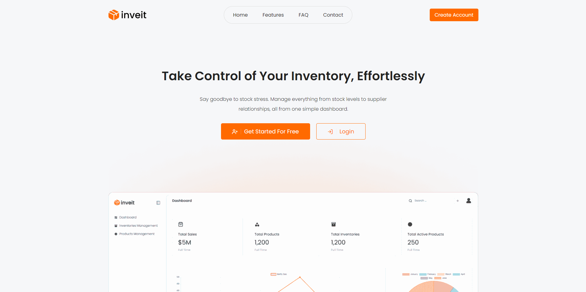
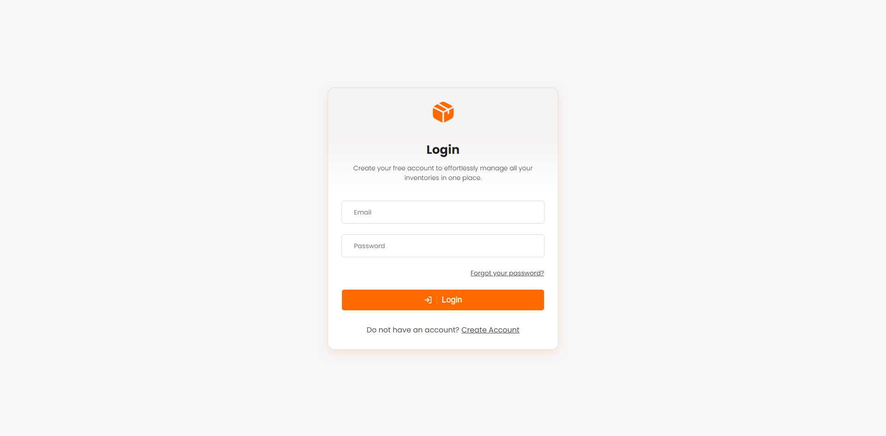
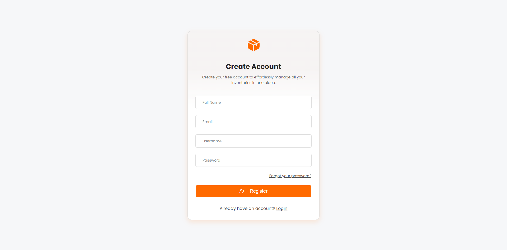
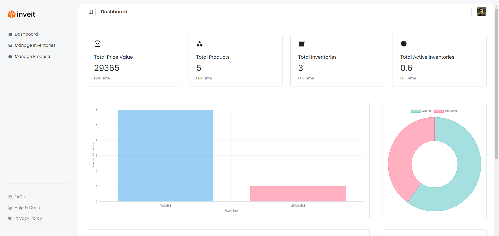
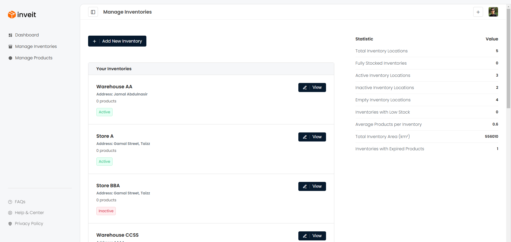

<h1>Web Client for Inventory Management API</h1>

This web client is a simple front-end application created while learning and developing the [**Inventory Management API**](https://github.com/khaledsAlshibani/inventory-management-api). It provides a basic interface for interacting with the API, including creating account, login, and managing inventories and products. The client is designed to demonstrate how a front-end application can work with a RESTful API.

---

## Table of Contents

- [Table of Contents](#table-of-contents)
- [Introduction](#introduction)
- [Screenshots](#screenshots)
- [Technologies Used](#technologies-used)
- [Installation \& Usage](#installation--usage)
  - [1. Clone the Repository](#1-clone-the-repository)
  - [2. Set Up the Backend API](#2-set-up-the-backend-api)
  - [3. Install Dependencies and Start the Client](#3-install-dependencies-and-start-the-client)
- [Development](#development)
  - [Development Mode](#development-mode)
  - [Production Deployment](#production-deployment)

---

## Introduction

The web client allows users to:
- Log in to the system.
- Create accounts.
- View and manage inventories.
- Navigate through a basic dashboard.

This project was created to practice front-end and back-end integration during the API development process.

---

## Screenshots

Here are some screenshots of the web client interface:

- **Homepage**  
  

- **Login Page**  
  

- **Create Account Page**  
  

- **Dashboard**  
  

- **Inventories Page**  
  

---

## Installation & Usage

### 1. Clone the Repository  
Clone the web client repository to your local machine:

```bash
git clone https://github.com/khaledsAlshibani/inventory-management-web-client
cd inventory-management-web-client
```

### 2. Set Up the Backend API  
Ensure the Inventory Management API is running locally or on a server. The web client is configured to use the following API base URL by default:

```
http://localhost:8082/api/v1/
```

To change the base URL, change it from [**this file**](src/js/api/api-config.mjs). Change these:

```javascript
export const API_VERSION = [API VERSION];
export const API_BASE_URL = [YOUR NER API URL];
```

You can set up the backend API by following the instructions provided [**here**](https://github.com/khaledsAlshibani/inventory-management-api#usage).

### 3. Install Dependencies and Start the Client  

Install the necessary dependencies and build the client for production:

```bash
npm install
npm run build
npm start
```

The application will be available at:  
```
http://localhost:3000
```

---

## Development

The web client uses **SCSS** and **Handlebars** for templating and styling. Custom scripts have been created to manage the development process and build a production ready version.

### Development Mode

While developing, use the following command to start the application in development mode:

```bash
npm run dev
```

- The app will run on `http://localhost:3000` and serve content from the `dist` directory.
- Any changes to the source files will be automatically detected and compiled.

### Production Deployment

For deployment, the **`dist`** directory contains the production-ready version of the application. You can serve the files from any static server or hosting platform.
